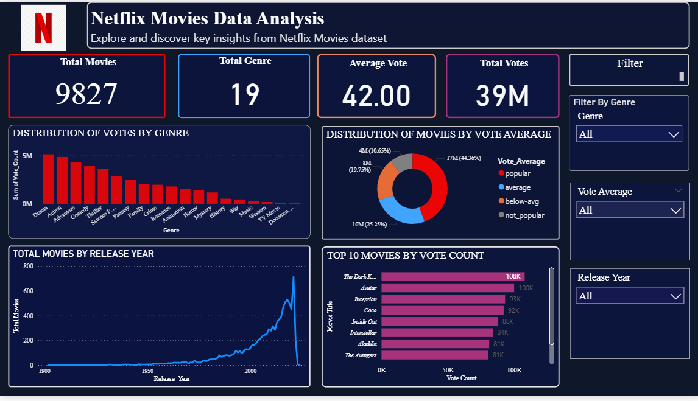
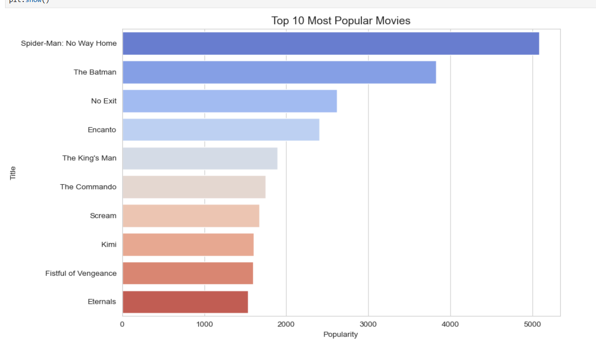
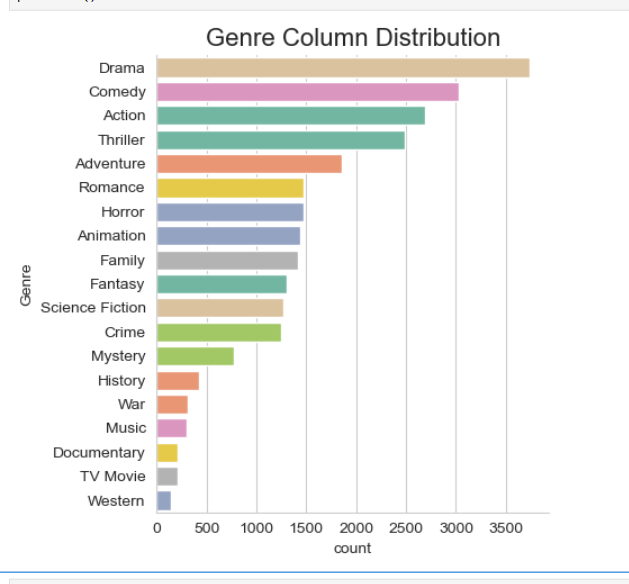
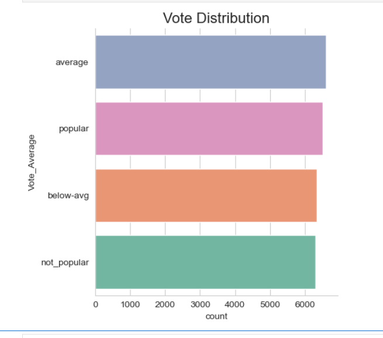
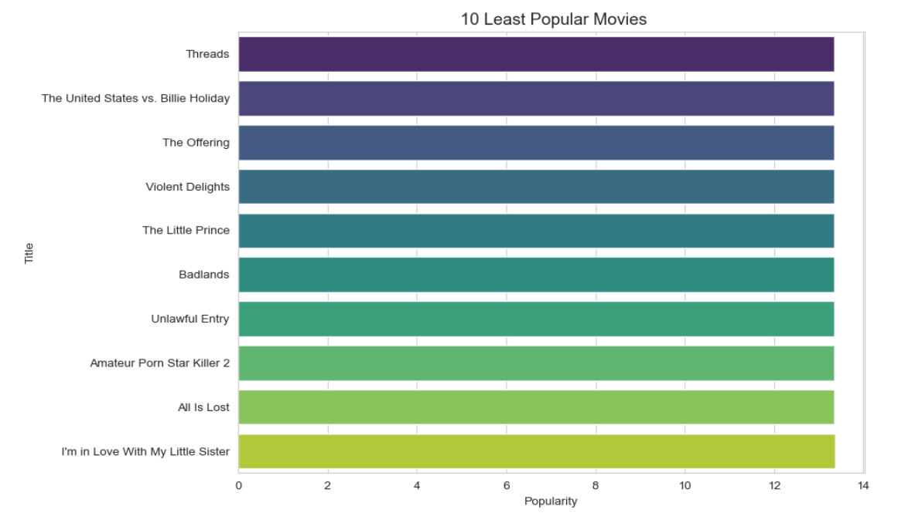

# Netflix_Movie_Data_Analysis
Netflix data analysis &amp; dashboard project using Python.

📌 Project Overview

This project focuses on analyzing a Netflix movie dataset to extract meaningful insights about genres, popularity, and release trends. The analysis is based on key business questions and is supported by an interactive dashboard.

🎯 Problem Statements

The project aims to answer the following questions:

1. What is the most frequent genre of movies released on Netflix? 
2. Which genre has the highest number of votes?
3. Which movie has the highest popularity? What is its genre?
4. Which movie has the lowest popularity? What is its genre?
5. Which year has the highest number of movie releases?

🛠️ Tech Stack
Python
Pandas
NumPy
Matplotlib
Seaborn
Streamlit / Power BI (Dashboard)

📂 Dataset
- Source: Netflix Movies Dataset
-Format: CSV
-Contains information such as:
-Movie Title
-Genre
-Popularity
-Votes
Release Year

🔍 Data Analysis Process
1. Data Cleaning
-Handling missing values
-Removing duplicates
2. Exploratory Data Analysis (EDA)
-Genre distribution
-Popularity analysis
-Votes comparison
-Year-wise movie trends

📊 Key Insights
1.The most frequent genre on Netflix is Drama
2. The most popular movie is Spider Man :No Way Home. with Genre (Action, Adventure, Science Fiction).
3.The least popular movie is The United States vs. Billie Holiday	with Genre (Music, Drama, History).
4. The year with most releases is 2021.

🚀 Project Highlights
Interactive Power BI Dashboard
Real-world dataset analysis
Business problem solving approach
Clean and structured data pipeline

 

📊 Dashboard Output

## 📊 Power BI Dashboard

  

## 📈 Python Analysis Output

  

  

  

  

📌 Author

Chabbi Bala
